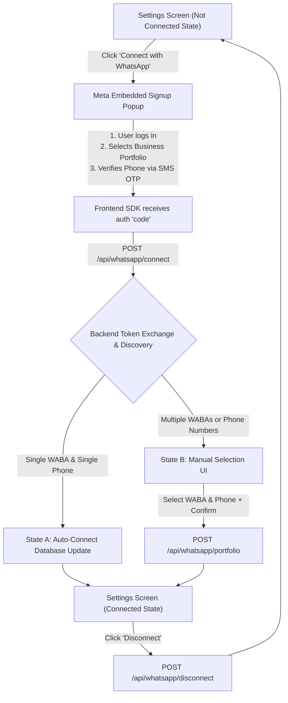

# LeapCreww App WhatsApp Onboarding UX & System Flow

This document standardizes the customer-facing WhatsApp Business onboarding flow inside the **LeapCreww / AiSensy Clone** application. It maps out the user experience (UX) states, screens, backend endpoints, and database transitions to align development and support teams.

---

## 🗺️ System Flow Architecture



---

## 🖥️ Onboarding Screens & UX States

### State 1: The "Not Connected" Landing Screen
This is the starting screen for a customer who hasn't integrated WhatsApp yet. It builds trust by explaining how LeapCreww manages security and privacy.

* **UI File Path:** `src/features/settings/components/SettingsTab.tsx`
* **Visual Components:**
  * **WhatsApp Connection Card:** Displayed in a sleek, borders-rounded card with a neutral grey icon and status label: `NOT CONNECTED`.
  * **Security Info Box:** Reassures the customer:
    * *Ownership:* "Your WhatsApp number stays yours — we never take ownership."
    * *Credentials:* "We never store your Facebook/Meta login credentials."
    * *Flexibility:* "You can disconnect anytime from this settings page."
  * **Main Action Button:** A large brand-blue button styled exactly to Facebook's design language: **"Connect with WhatsApp"**.

---

### State 2: Meta Embedded Signup Popup
When the user clicks **"Connect with WhatsApp"**, the app loads the Facebook JavaScript SDK and opens the official secure Meta popup.

* **Trigger Function:** `launchEmbeddedSignup()`
* **Technical Flow:**
  1. Calls `FB.login()` with your platform's unique `config_id` (from `process.env.NEXT_PUBLIC_META_CONFIG_ID`).
  2. The customer completes the following official steps inside the Meta popup:
     * **Step A:** Logs into their Facebook personal account.
     * **Step B:** Selects or creates their Meta Business Portfolio (e.g. *Smritix*).
     * **Step C:** Selects or creates their WhatsApp Business Account (WABA).
     * **Step D:** Adds their display name and verifies their phone number using a 6-digit SMS/Voice OTP.
     * **Step E:** Approves permissions (`whatsapp_business_management`, `whatsapp_business_messaging`, `business_management`) for the LeapCreww App.
  3. Upon completion, the popup closes, and the SDK returns a short-lived authorization `code` to the frontend callback handler `handleSignupCallback(code)`.

---

### State 3: Backend Exchange & Asset Discovery (Invisible)
The frontend immediately sends the short-lived `code` to the backend to discover the customer's assets.

* **Endpoint:** `POST /api/whatsapp/connect`
* **JSON Payload:**
  ```json
  {
    "orgId": "customer-organization-uuid",
    "code": "meta-auth-code-from-callback"
  }
  ```
* **Backend Pipeline:**
  1. **Token Exchange:** The backend calls Meta's Graph API (`/oauth/access_token`) to exchange the short-lived code for a user access token.
  2. **WABA Discovery:** Using the token, it queries Meta to discover all WABAs and Business IDs linked to the customer's portfolio.
  3. **Phone Number Discovery:** For each discovered WABA, it queries all associated phone numbers, display names, and quality ratings.
  4. **Security Enforcement:** **Important!** LeapCreww *never* saves this short-lived access token in the database. It is used strictly in-memory during this request to discover IDs and is then permanently discarded. All future messaging calls use LeapCreww's secure, platform-level **System User Token**.

---

### State 4: Connection Execution (Conditional Branching)

Depending on what the backend discovers, the user is seamlessly routed into one of two sub-states:

#### State 4A: Auto-Connection (Single WABA + Single Phone)
If the customer has exactly **one** WhatsApp Business Account and **one** verified phone number:
* **UX Experience:** The system skips any manual steps, shows a green success toast: `"Connected! Phone: +91 XXXX XXXX"`, and instantly redirects the user to the **Connected State**.
* **Database Updates:** The `Organization` table is updated directly:
  * `whatsappBusinessAccountId` is set.
  * `whatsappPhoneNumberId` is set.
  * `metaBusinessId` is set.
  * `whatsappConnected` is set to `true`.
* **System Log:** Generates a CRM category audit log: `WhatsApp connected: WABA "Name" (ID), Phone: +91 XXXX`.

#### State 4B: Manual Account Selection (Multiple WABAs or Phones)
If the customer has multiple WABAs or multiple phone numbers associated with their business portfolio:
* **UX Experience:** The system displays a selection dashboard.
* **UI Elements:**
  * **Instruction Banner:** A soft blue box saying: *"Multiple WhatsApp Business Accounts found. Please select..."*
  * **WABA Selector Accordions:** A list of all discovered portfolios. Clicking a portfolio expands it, showing its verified phone numbers.
  * **Verification Badges:** Shows the phone number's display name and quality ratings so the user picks the correct business line.
  * **Main Action Button:** **"Connect Selected Account"** (starts out disabled until a valid WABA and Phone ID are selected).
* **Technical Flow:** Clicking connect triggers a POST to `/api/whatsapp/portfolio` with the selected IDs to save them to the database and update `whatsappConnected` to `true`.

---

### State 5: The "Connected" Dashboard
Once connected, the settings panel transforms into an elegant, green-themed active status dashboard.

* **Visual Components:**
  * **Pulse Indicator:** A glowing, pulsing green dot indicating the integration is active.
  * **Monospaced ID Badges:** High-contrast, clean boxes showing:
    * **WABA ID** (WhatsApp Business Account ID)
    * **Phone Number ID** (Core API messaging target)
    * **Business ID** (Meta Business Suite Portfolio ID)
  * **Refresh Status Button:** Let's the user poll `/api/whatsapp/status` to sync any display name or quality status changes from Meta.
  * **Disconnect Integration Button:** A red action button allowing the customer to safely disconnect.
    * *UX Safeguard:* Triggers a native window confirmation prompt to prevent accidental disconnections.
    * *Technical Flow:* Triggers a POST to `/api/whatsapp/disconnect` which resets all IDs to `null` and `whatsappConnected` to `false` in the database, immediately returning the UI to **State 1**.

---

## 💾 Database Schema Reference (Prisma)

Below are the key fields in the `Organization` table used to store and manage this onboarding state:

```prisma
model Organization {
  id                         String   @id @default(uuid())
  name                       String
  slug                       String   @unique
  
  // WhatsApp Integration Identifiers
  whatsappBusinessAccountId  String?  // WABA ID (real ID, e.g. 1626500191974104)
  whatsappPhoneNumberId      String?  // Phone Number ID (real ID, e.g. 1060212173852127)
  metaBusinessId             String?  // Meta Business Portfolio ID
  whatsappConnected          Boolean  @default(false)
  
  // Onboarding metadata
  onboardingDismissed        Boolean  @default(false)
}
```
